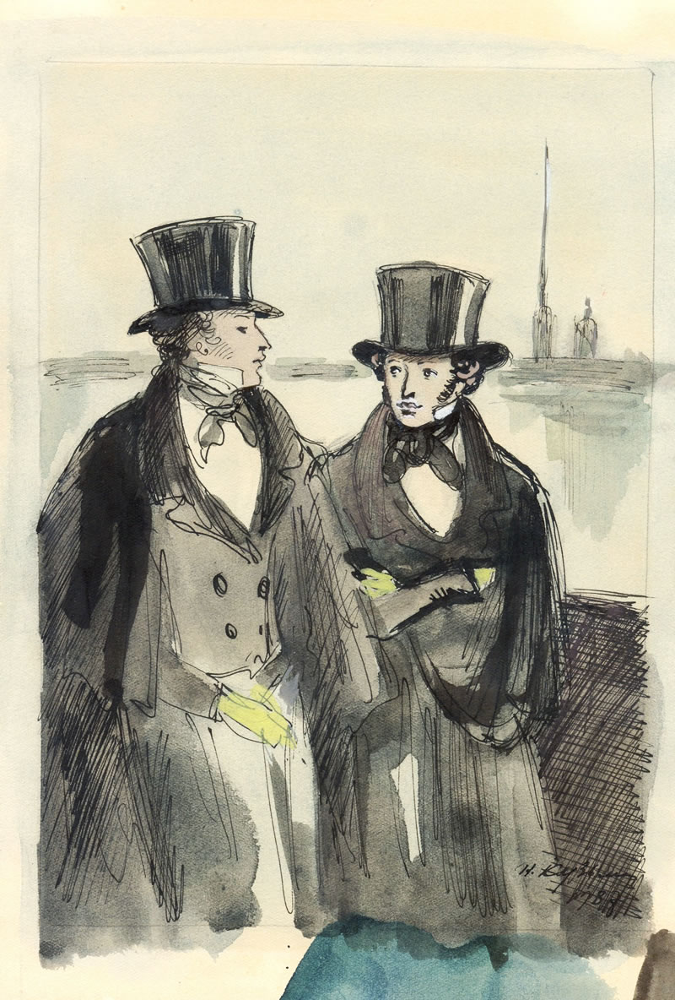

# Task Onegin


**bold**
*italic*
***text***
_text_
__text__
___text___
~~text~~

> 1 lvl
>> 2 lvl

текст строка внутри которой `x = 2`

```cpp
void main(){
    printf("hi");
    int x = 10;

}
```

+ ghdhdd
  + hiel
    + hie;e
      + hile;e
        + hleis

1. test
2. eksef
   1. hiesf
   2. isfles
      1. shiefles

- [ ] ldsafjads
- [X] ka;sfdj

https://vk.com/py

[link](https://vk.com)





| LEFT | generik | hil |
|------|:-----------:|--------:|
|tesxt | slfaesf  sdf| sadfs   |
